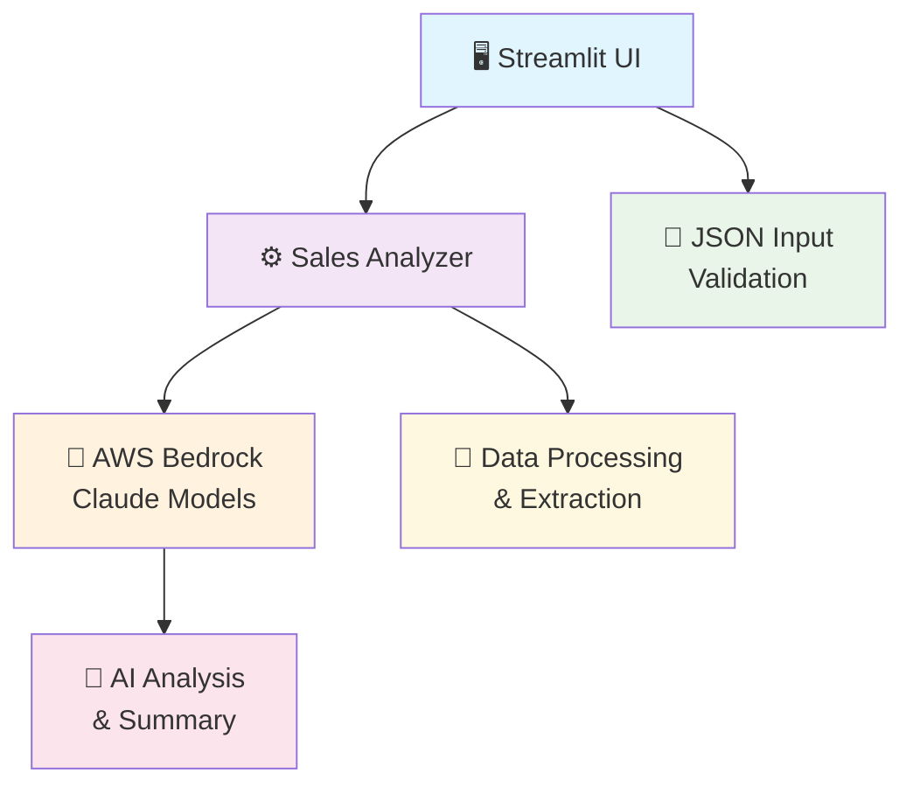
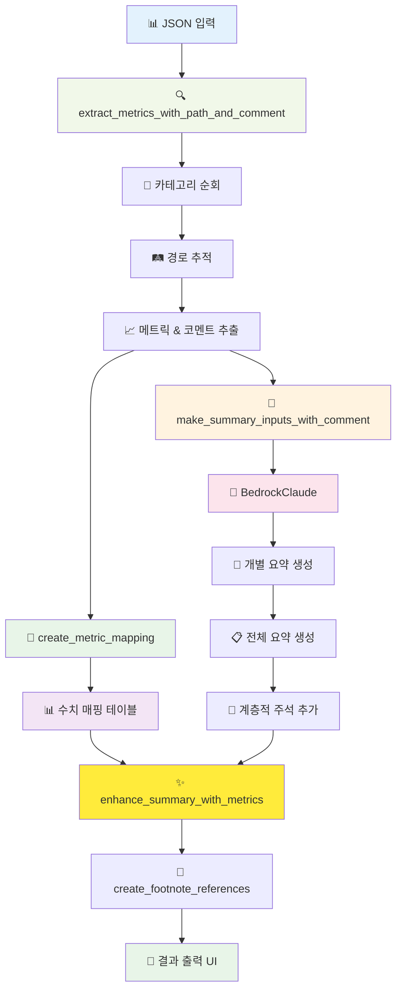
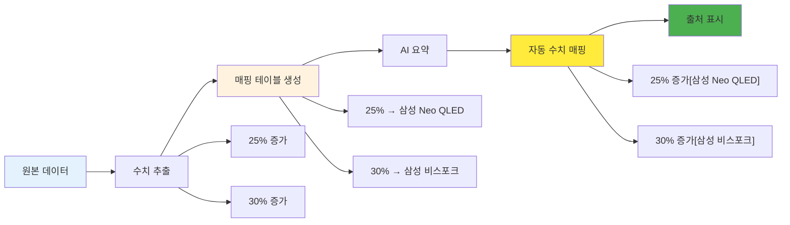
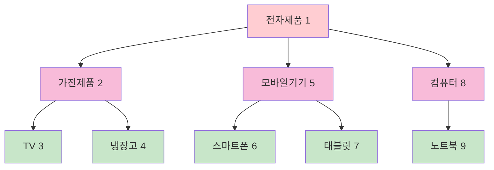
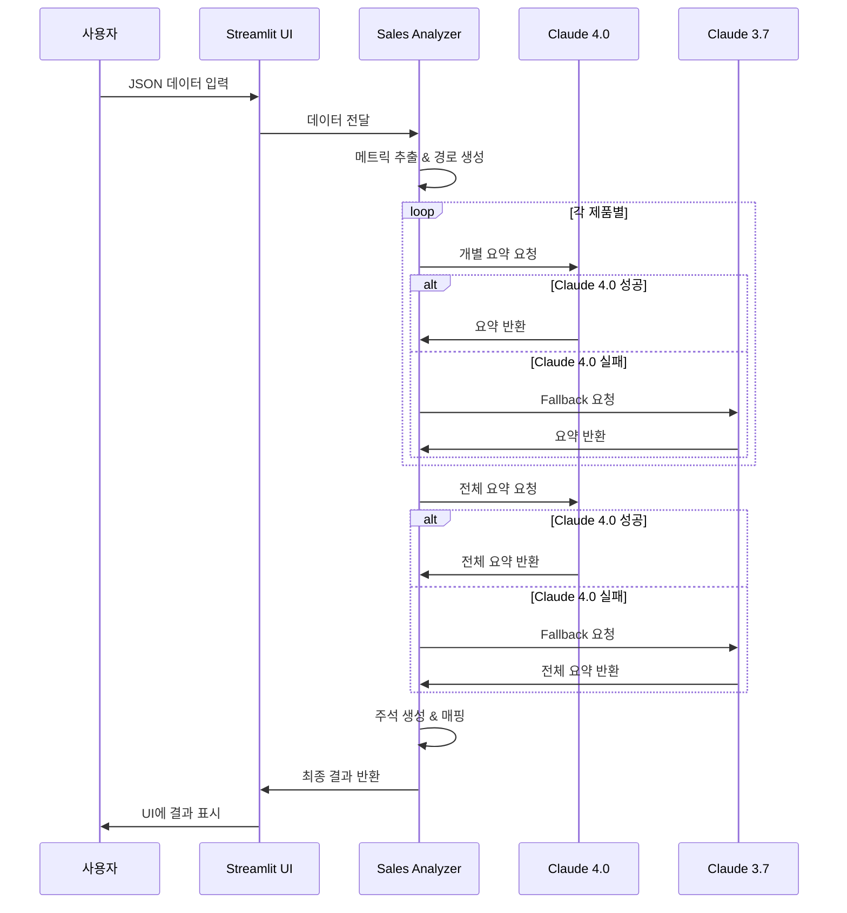
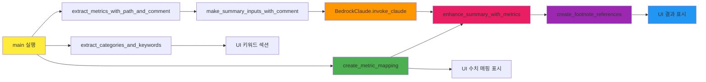
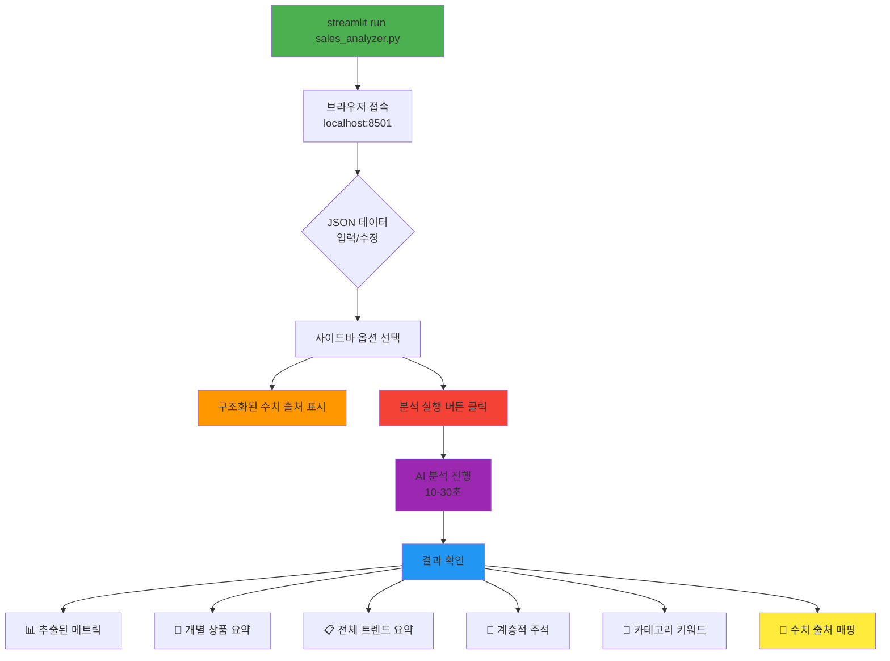
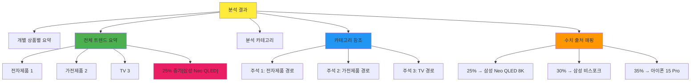
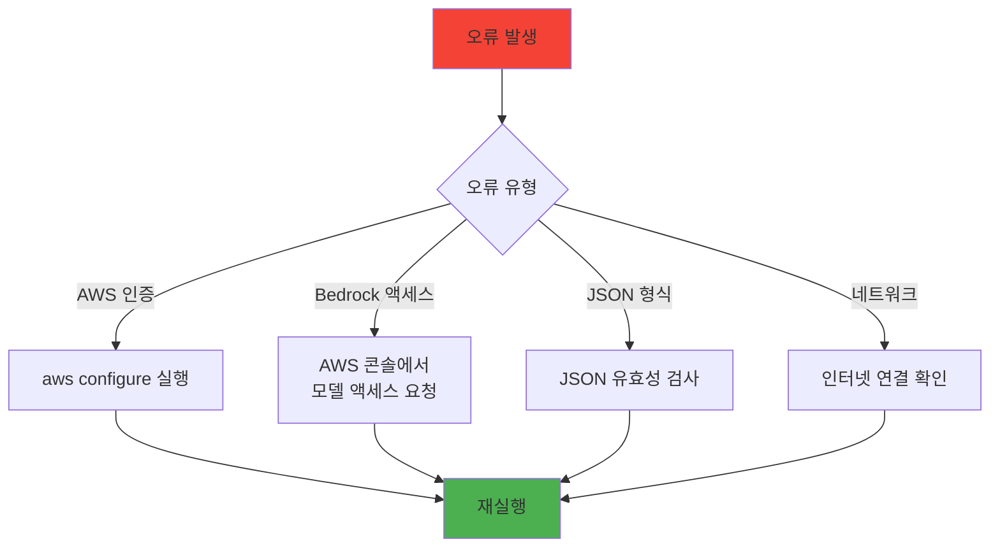

# 매출 데이터 분석기 (Sales Data Analyzer)

AI 기반 계층적 매출 데이터 분석 및 트렌드 요약 시스템

## 📋 Prerequisites

### 시스템 요구사항
- Python 3.8+
- AWS 계정 및 Bedrock 서비스 액세스 권한
- 인터넷 연결

### AWS 설정
```bash
# AWS CLI 설치 및 구성
pip install awscli
aws configure
```

### 필요한 AWS 권한
```json
{
    "Version": "2012-10-17",
    "Statement": [
        {
            "Effect": "Allow",
            "Action": [
                "bedrock:InvokeModel"
            ],
            "Resource": [
                "arn:aws:bedrock:us-east-1::foundation-model/us.anthropic.claude-3-5-sonnet-20241022-v2:0",
                "arn:aws:bedrock:us-east-1::foundation-model/us.anthropic.claude-3-5-sonnet-20240620-v1:0"
            ]
        }
    ]
}
```

## 🚀 설치

### 1. 의존성 설치
```bash
pip install streamlit boto3
```

### 2. 프로젝트 클론/다운로드
```bash
# 파일 다운로드 후
cd /path/to/sales_analyzer
```

### 3. AWS 자격 증명 설정
```bash
# 방법 1: AWS CLI 구성
aws configure

# 방법 2: 환경 변수 설정
export AWS_ACCESS_KEY_ID=your_access_key
export AWS_SECRET_ACCESS_KEY=your_secret_key
export AWS_DEFAULT_REGION=us-east-1
```

## 🏗️ 아키텍처

### 전체 시스템 아키텍처


### 데이터 처리 플로우


### 수치 출처 추적 시스템


### 계층적 주석 시스템


### Claude AI 처리 흐름


## 🔧 주요 함수 분석

### 함수 관계도


### 1. `BedrockClaude` 클래스
```python
class BedrockClaude:
    def __init__(self):
        # Claude 4.0 (Sonnet v2) 및 3.7 (Sonnet v1) 모델 설정
    
    def invoke_claude(self, prompt):
        # Fallback 메커니즘: 4.0 실패 시 3.7로 자동 전환
```

**기능**: AWS Bedrock을 통한 Claude AI 모델 호출 및 Fallback 처리

### 2. `create_metric_mapping` (신규)
```python
def create_metric_mapping(metrics_info):
    # 퍼센트 수치와 제품 매핑 테이블 생성
    # 매출 수치와 제품 매핑
    # 반환: {"25%": [{"product": "삼성 Neo QLED", "category_path": "..."}]}
```

**기능**: 수치 정보와 제품/카테고리 매핑 테이블 생성

### 3. `enhance_summary_with_metrics` (신규)
```python
def enhance_summary_with_metrics(summary_text, metric_map):
    # "25% 증가" → "25% 증가[삼성 Neo QLED]"로 자동 변환
    # 수치 출처 정보 자동 추가
```

**기능**: AI 요약에 수치 출처 정보 자동 추가

### 4. `create_structured_prompt` (신규)
```python
def create_structured_prompt(docs_text, category_list, enable_structured_output=False):
    # 기본 프롬프트 또는 구조화된 출력 프롬프트 생성
    # 사용자 선택에 따라 AI에게 수치 출처 포함 요청
```

**기능**: 선택적 구조화된 AI 출력 프롬프트 생성

### 5. `extract_metrics_with_path_and_comment`
```python
def extract_metrics_with_path_and_comment(data, path=None, comments=None):
    # 재귀적으로 JSON 구조 탐색
    # 각 메트릭에 대해 전체 경로와 코멘트 추적
    # 반환: 메트릭 리스트 (경로, 코멘트, 제품 정보 포함)
```

### 6. `create_footnote_references`
```python
def create_footnote_references(summary_text, metrics_info):
    # 계층별 카테고리 경로 생성
    # 주석 번호 할당 (계층 순서대로)
    # 텍스트 내 카테고리명에 주석 추가
```

## 📊 데이터 구조

### JSON 입력 형식
```json
{
  "category": "전자제품",
  "comment": "시장 전반 코멘트",
  "subcategories": [
    {
      "category": "가전제품",
      "comment": "중간 계층 코멘트",
      "subcategories": [
        {
          "category": "TV",
          "comment": "세부 카테고리 코멘트",
          "metrics": [
            {
              "product": "삼성 Neo QLED 8K",
              "sales": 2850,
              "change": "increase",
              "description": "AI 화질 개선과 게이밍 기능으로 25% 증가",
              "comment": "프리미엄 시장 선도"
            }
          ]
        }
      ]
    }
  ]
}
```

### 데이터 변환 과정


## 🎯 사용 방법

### 실행 플로우


### 새로운 기능

#### 1. 수치 출처 추적
- **자동 매핑**: "25% 증가" → "25% 증가[삼성 Neo QLED 8K]"
- **매핑 테이블**: 사이드바에서 수치별 제품 출처 확인
- **신뢰성**: 원본 데이터 기반 100% 정확한 매핑

#### 2. 구조화된 출력 (선택적)
- **사이드바 옵션**: "구조화된 수치 출처 표시" 체크박스
- **AI 직접 출력**: Claude가 수치와 함께 제품명 포함하여 요약
- **실험적 기능**: 기본 매핑과 병행 사용

#### 3. 향상된 UI
- **수치 매핑 섹션**: 확장 가능한 수치별 제품 매핑 정보
- **개선 알림**: 수치 출처 자동 추가 시 성공 메시지
- **이중 검증**: 방법 1(자동) + 방법 2(AI) 병행

### 1. 기본 실행
```bash
streamlit run sales_analyzer.py
```

### 2. 브라우저에서 접속
```
http://localhost:8501
```

## 📝 사용 예시

### 예시 출력 구조


### 예시 출력
```
전체 트렌드 요약:
전자제품[1] 시장에서는 AI 기술 통합이 가속화되고 있으며, 
TV[3] 부문에서 25% 증가[삼성 Neo QLED 8K]를 기록했습니다.
냉장고[4] 분야에서는 30% 증가[삼성 비스포크 4도어]로 
맞춤형 디자인이 주효했습니다.

🔢 수치 출처 매핑:
**25%:**
  • 삼성 Neo QLED 8K (전자제품 > 가전제품 > TV)
**30%:**
  • 삼성 비스포크 4도어 (전자제품 > 가전제품 > 냉장고)

📝 카테고리 참조:
[1] 전자제품: AI 기술 통합과 친환경 트렌드 주도
[3] 전자제품 > 가전제품 > TV: 8K, OLED 기술과 스마트 기능 강화
[4] 전자제품 > 가전제품 > 냉장고: 대용량, 스마트 기능, 에너지 효율성
```

## 🚨 문제 해결

### 오류 해결 플로우


## 📈 확장 가능성

### 확장 로드맵


## 📄 라이선스

MIT License

## 🤝 기여

1. Fork the repository
2. Create feature branch
3. Commit changes
4. Push to branch
5. Create Pull Request

## 📞 지원

문의사항이나 버그 리포트는 이슈 탭에서 등록해 주세요.
