# 매출 데이터 분석기 (Sales Data Analyzer)

AI 기반 계층적 매출 데이터 분석 및 트렌드 요약 시스템

## 📋 Prerequisites

### 시스템 요구사항
- Python 3.8+
- AWS 계정 및 Bedrock 서비스 액세스 권한
- 인터넷 연결

### AWS 설정
```bash
# AWS CLI 설치 및 구성
pip install awscli
aws configure
```

### 필요한 AWS 권한
```json
{
    "Version": "2012-10-17",
    "Statement": [
        {
            "Effect": "Allow",
            "Action": [
                "bedrock:InvokeModel"
            ],
            "Resource": [
                "arn:aws:bedrock:us-east-1::foundation-model/us.anthropic.claude-3-5-sonnet-20241022-v2:0",
                "arn:aws:bedrock:us-east-1::foundation-model/us.anthropic.claude-3-5-sonnet-20240620-v1:0"
            ]
        }
    ]
}
```

## 🚀 설치

### 1. 의존성 설치
```bash
pip install streamlit boto3
```

### 2. 프로젝트 클론/다운로드
```bash
# 파일 다운로드 후
cd /path/to/sales_analyzer
```

### 3. AWS 자격 증명 설정
```bash
# 방법 1: AWS CLI 구성
aws configure

# 방법 2: 환경 변수 설정
export AWS_ACCESS_KEY_ID=your_access_key
export AWS_SECRET_ACCESS_KEY=your_secret_key
export AWS_DEFAULT_REGION=us-east-1
```

## 🏗️ 아키텍처

### 전체 시스템 아키텍처

```mermaid
graph TB
    A[🖥️ Streamlit UI] --> B[⚙️ Sales Analyzer]
    B --> C[🤖 AWS Bedrock<br/>Claude Models]
    
    A --> D[📝 JSON Input<br/>Validation]
    B --> E[🔄 Data Processing<br/>& Extraction]
    C --> F[🧠 AI Analysis<br/>& Summary]
    
    style A fill:#e1f5fe
    style B fill:#f3e5f5
    style C fill:#fff3e0
    style D fill:#e8f5e8
    style E fill:#fff8e1
    style F fill:#fce4ec
```


### 데이터 처리 플로우

```mermaid
flowchart TD
    A[📊 JSON 입력] --> B[🔍 extract_metrics_with_path_and_comment]
    
    B --> B1[📂 카테고리 순회]
    B1 --> B2[🛤️ 경로 추적]
    B2 --> B3[📈 메트릭 & 코멘트 추출]
    
    B3 --> C[🔄 make_summary_inputs_with_comment]
    C --> D[🤖 BedrockClaude]
    
    D --> D1[📝 개별 요약 생성]
    D1 --> D2[📋 전체 요약 생성]
    D2 --> D3[🔗 계층적 주석 추가]
    
    D3 --> E[📌 create_footnote_references]
    E --> F[🎯 결과 출력 UI]
    
    style A fill:#e3f2fd
    style B fill:#f1f8e9
    style C fill:#fff3e0
    style D fill:#fce4ec
    style E fill:#f3e5f5
    style F fill:#e8f5e8
```


### 계층적 주석 시스템

```mermaid
graph TD
    A[전자제품 1] --> B[가전제품 2]
    A --> C[모바일기기 5]
    A --> D[컴퓨터 8]
    
    B --> E[TV 3]
    B --> F[냉장고 4]
    
    C --> G[스마트폰 6]
    C --> H[태블릿 7]
    
    D --> I[노트북 9]
    
    style A fill:#ffcdd2
    style B fill:#f8bbd9
    style C fill:#f8bbd9
    style D fill:#f8bbd9
    style E fill:#c8e6c9
    style F fill:#c8e6c9
    style G fill:#c8e6c9
    style H fill:#c8e6c9
    style I fill:#c8e6c9
```


### Claude AI 처리 흐름

```mermaid
sequenceDiagram
    participant U as 사용자
    participant S as Streamlit UI
    participant A as Sales Analyzer
    participant C4 as Claude 4.0
    participant C3 as Claude 3.7
    
    U->>S: JSON 데이터 입력
    S->>A: 데이터 전달
    A->>A: 메트릭 추출 & 경로 생성
    
    loop 각 제품별
        A->>C4: 개별 요약 요청
        alt Claude 4.0 성공
            C4->>A: 요약 반환
        else Claude 4.0 실패
            A->>C3: Fallback 요청
            C3->>A: 요약 반환
        end
    end
    
    A->>C4: 전체 요약 요청
    alt Claude 4.0 성공
        C4->>A: 전체 요약 반환
    else Claude 4.0 실패
        A->>C3: Fallback 요청
        C3->>A: 전체 요약 반환
    end
    
    A->>A: 주석 생성 & 매핑
    A->>S: 최종 결과 반환
    S->>U: UI에 결과 표시
```


## 🔧 주요 함수 분석

### 함수 관계도

```mermaid
graph LR
    A[main 실행] --> B[extract_metrics_with_path_and_comment]
    A --> C[extract_categories_and_keywords]
    
    B --> D[make_summary_inputs_with_comment]
    D --> E[BedrockClaude.invoke_claude]
    
    E --> F[create_footnote_references]
    C --> G[UI 키워드 섹션]
    F --> H[UI 결과 표시]
    
    style A fill:#ffeb3b
    style E fill:#ff9800
    style F fill:#4caf50
    style H fill:#2196f3
```


### 1. `BedrockClaude` 클래스
```python
class BedrockClaude:
    def __init__(self):
        # Claude 4.0 (Sonnet v2) 및 3.7 (Sonnet v1) 모델 설정
    
    def invoke_claude(self, prompt):
        # Fallback 메커니즘: 4.0 실패 시 3.7로 자동 전환
```

**기능**: AWS Bedrock을 통한 Claude AI 모델 호출 및 Fallback 처리

### 2. `extract_metrics_with_path_and_comment`
```python
def extract_metrics_with_path_and_comment(data, path=None, comments=None):
    # 재귀적으로 JSON 구조 탐색
    # 각 메트릭에 대해 전체 경로와 코멘트 추적
    # 반환: 메트릭 리스트 (경로, 코멘트, 제품 정보 포함)
```

### 3. `create_footnote_references`
```python
def create_footnote_references(summary_text, metrics_info):
    # 계층별 카테고리 경로 생성
    # 주석 번호 할당 (계층 순서대로)
    # 텍스트 내 카테고리명에 주석 추가
```

## 📊 데이터 구조

### JSON 입력 형식
```json
{
  "category": "전자제품",
  "comment": "시장 전반 코멘트",
  "subcategories": [
    {
      "category": "가전제품",
      "comment": "중간 계층 코멘트",
      "subcategories": [
        {
          "category": "TV",
          "comment": "세부 카테고리 코멘트",
          "metrics": [
            {
              "product": "삼성 Neo QLED 8K",
              "sales": 2850,
              "change": "increase",
              "description": "AI 화질 개선과 게이밍 기능으로 25% 증가",
              "comment": "프리미엄 시장 선도"
            }
          ]
        }
      ]
    }
  ]
}
```

### 데이터 변환 과정

```mermaid
graph LR
    A[JSON 입력] --> B[메트릭 추출]
    B --> C[경로 & 코멘트<br/>매핑]
    C --> D[AI 입력 형식<br/>변환]
    D --> E[요약 생성]
    E --> F[주석 추가]
    F --> G[UI 출력]
    
    style A fill:#e3f2fd
    style D fill:#fff3e0
    style E fill:#fce4ec
    style G fill:#e8f5e8
```


## 🎯 사용 방법

### 실행 플로우

```mermaid
graph TD
    A[streamlit run sales_analyzer.py] --> B[브라우저 접속<br/>localhost:8501]
    B --> C{JSON 데이터<br/>입력/수정}
    C --> D[분석 실행 버튼 클릭]
    D --> E[AI 분석 진행<br/>10-30초]
    E --> F[결과 확인]
    
    F --> F1[📊 추출된 메트릭]
    F --> F2[📝 개별 상품 요약]
    F --> F3[📋 전체 트렌드 요약]
    F --> F4[🔗 계층적 주석]
    F --> F5[📌 카테고리 키워드]
    
    style A fill:#4caf50
    style D fill:#ff9800
    style E fill:#f44336
    style F fill:#2196f3
```


### 1. 기본 실행
```bash
streamlit run sales_analyzer.py
```

### 2. 브라우저에서 접속
```
http://localhost:8501
```

## 📝 사용 예시

### 예시 출력 구조

```mermaid
graph TB
    A[분석 결과] --> B[개별 상품별 요약]
    A --> C[전체 트렌드 요약]
    A --> D[분석 카테고리]
    A --> E[카테고리 참조]
    
    C --> C1[전자제품 1]
    C --> C2[가전제품 2]
    C --> C3[TV 3]
    
    E --> E1[주석 1: 전자제품 경로]
    E --> E2[주석 2: 가전제품 경로]
    E --> E3[주석 3: TV 경로]
    
    style A fill:#ffeb3b
    style C fill:#4caf50
    style E fill:#2196f3
```


### 예시 출력
```
전체 트렌드 요약:
식품[1] 시장에서는 건강식품 트렌드가 확산되고 있으며, 
음료[2] 부문에서는 무설탕 제품에 대한 선호가 두드러집니다.

📝 카테고리 참조:
[1] 식품: 건강식품 트렌드 확산
[2] 식품 > 음료: 건강식품 트렌드 확산 / 무설탕 제품 선호
```

## 🚨 문제 해결

### 오류 해결 플로우

```mermaid
graph TD
    A[오류 발생] --> B{오류 유형}
    
    B -->|AWS 인증| C[aws configure 실행]
    B -->|Bedrock 액세스| D[AWS 콘솔에서<br/>모델 액세스 요청]
    B -->|JSON 형식| E[JSON 유효성 검사]
    B -->|네트워크| F[인터넷 연결 확인]
    
    C --> G[재실행]
    D --> G
    E --> G
    F --> G
    
    style A fill:#f44336
    style G fill:#4caf50
```


## 📈 확장 가능성

### 확장 로드맵

```mermaid
graph LR
    A[현재 버전] --> B[다중 AI 모델]
    B --> C[데이터 소스 확장]
    C --> D[시각화 기능]
    D --> E[보고서 내보내기]
    
    style A fill:#4caf50
    style E fill:#ff9800
```


## 📄 라이선스

MIT License

## 🤝 기여

1. Fork the repository
2. Create feature branch
3. Commit changes
4. Push to branch
5. Create Pull Request

## 📞 지원

문의사항이나 버그 리포트는 이슈 탭에서 등록해 주세요.
